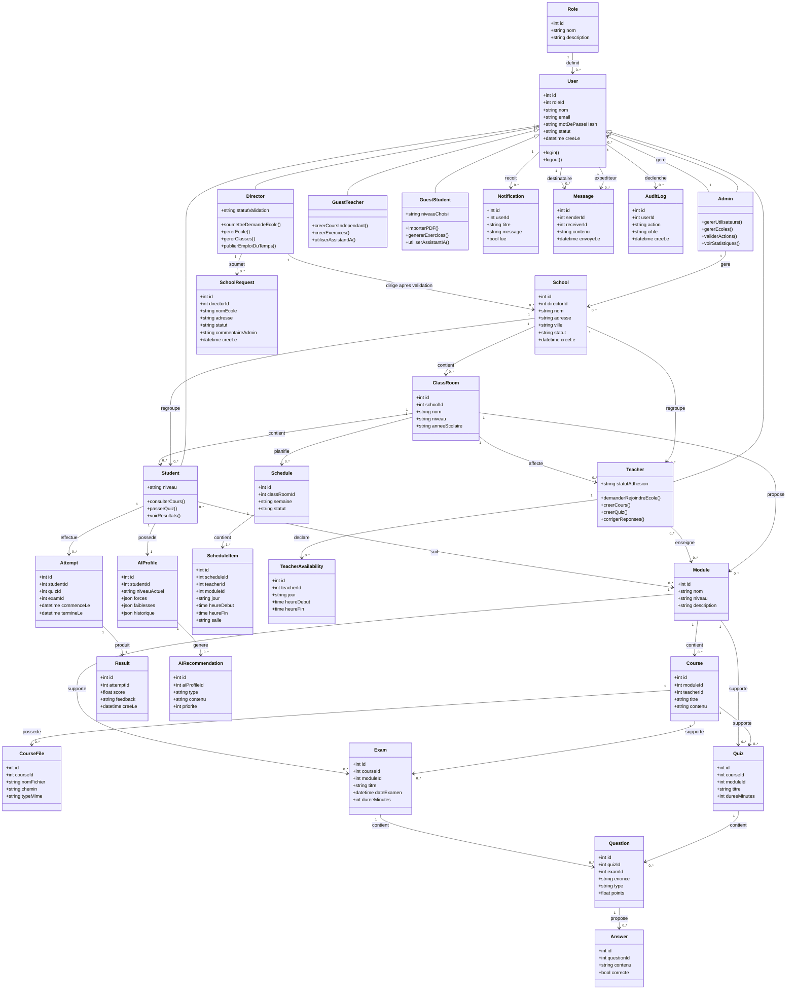
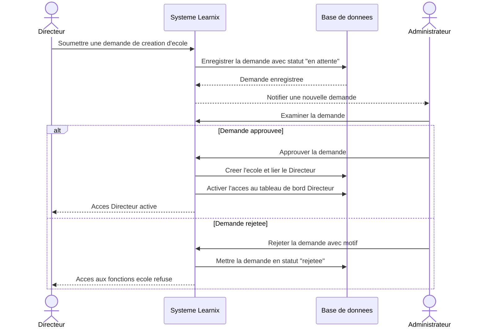
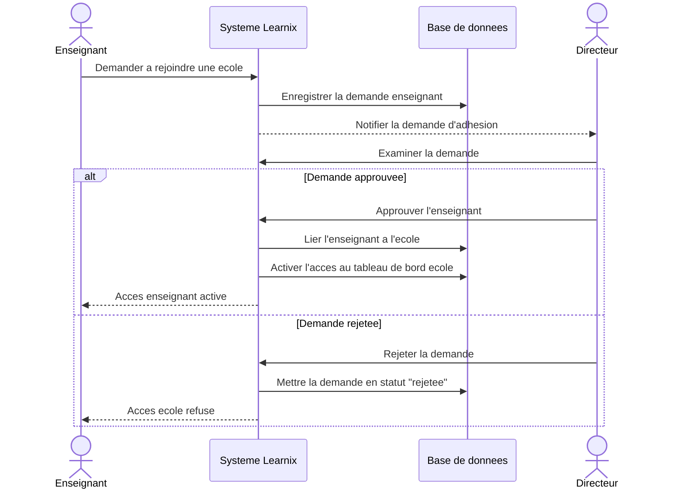
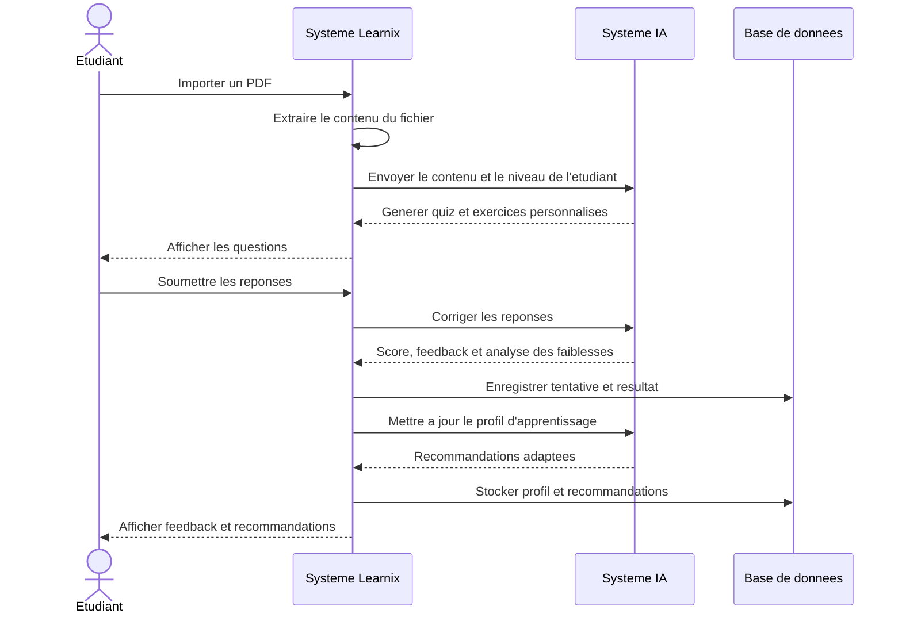
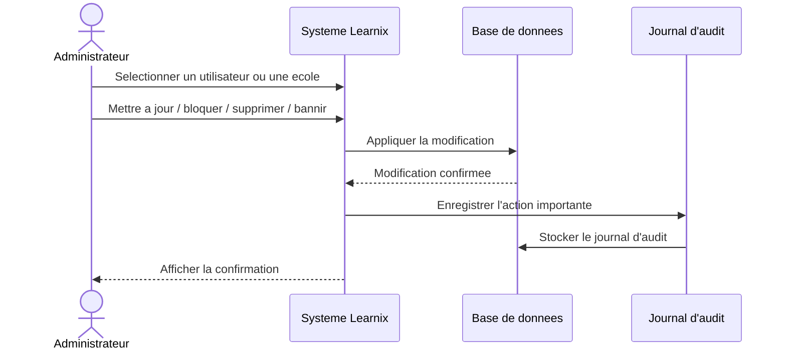
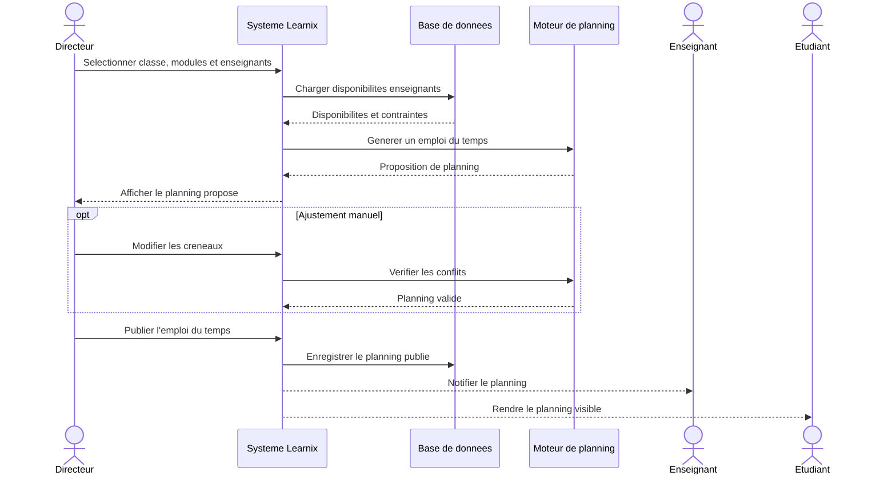
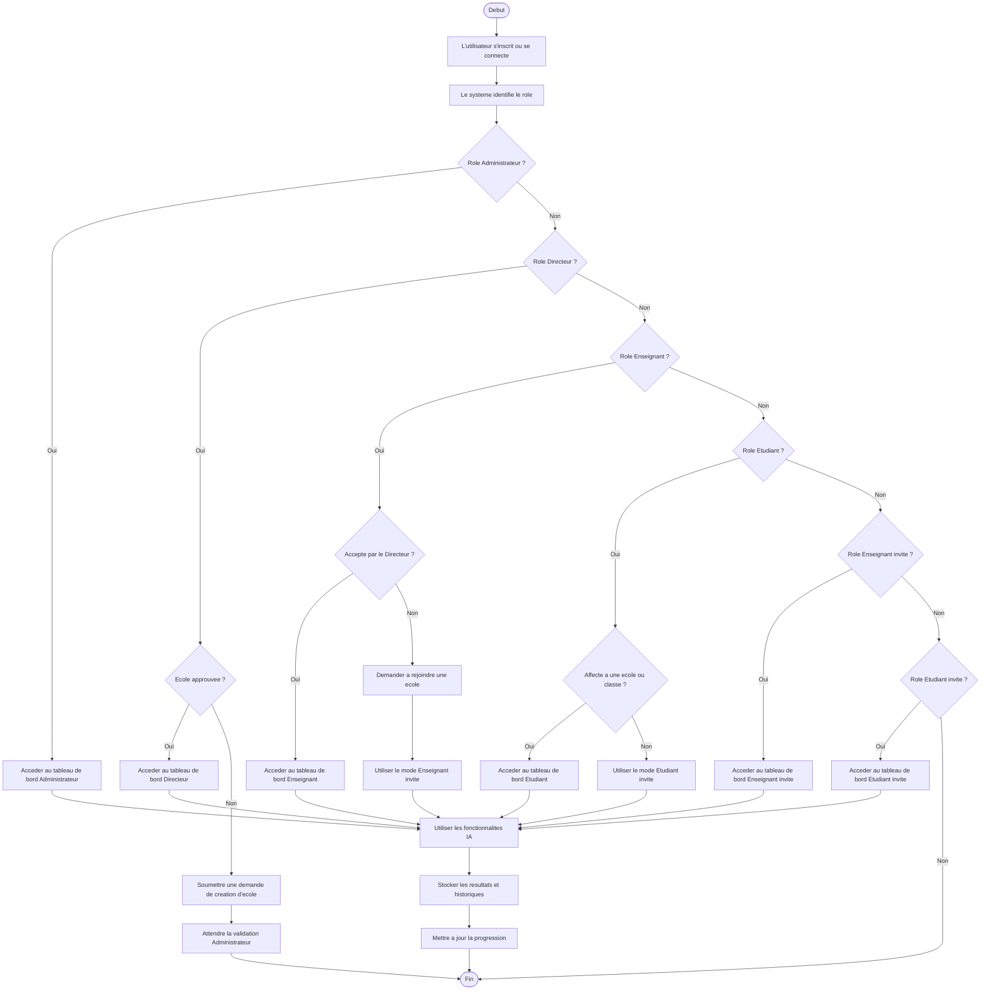
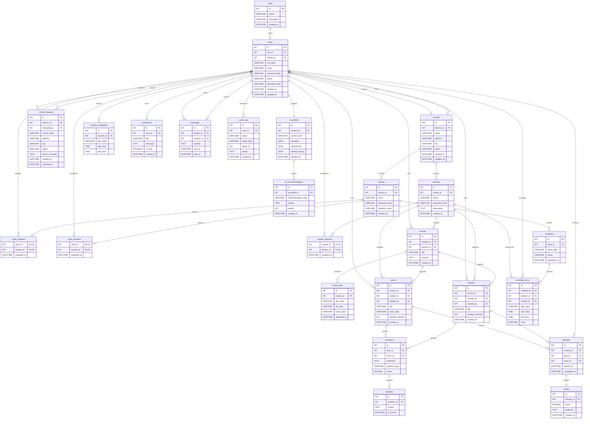

# Diagrammes UML et ERD - Learnix AI

Ce document regroupe les diagrammes Mermaid principaux de Learnix AI. Le flux Directeur est base sur la demande de creation d'ecole, puis sur l'acceptation ou le rejet par l'Administrateur.

## 1. Diagramme de cas d'utilisation

```mermaid
flowchart LR
    Admin["Administrateur"]
    Director["Directeur"]
    Teacher["Enseignant"]
    Student["Etudiant"]
    GuestTeacher["Enseignant invite"]
    GuestStudent["Etudiant invite"]
    AISystem["Systeme IA"]
    Database[("Base de donnees")]

    subgraph Platform["Plateforme Learnix AI"]
        UCManageUsers(("Gerer les utilisateurs"))
        UCManageSchools(("Gerer les ecoles"))
        UCCreateSchool(("Creer une ecole"))
        UCAssignSchool(("Affecter une ecole a un directeur"))
        UCApproveSchoolRequest(("Accepter / rejeter une demande d'ecole"))
        UCManageClasses(("Gerer les classes"))
        UCManageModules(("Gerer les modules"))
        UCManageTeachers(("Gerer les enseignants"))
        UCManageStudents(("Gerer les etudiants"))
        UCApproveTeacherRequest(("Accepter / rejeter une demande enseignant"))
        UCCreateCourses(("Creer des cours"))
        UCUploadPDF(("Importer un PDF"))
        UCGenerateExercises(("Generer des exercices"))
        UCCreateQuiz(("Creer un quiz"))
        UCCreateExam(("Creer un examen"))
        UCCorrectAnswers(("Corriger les reponses"))
        UCViewResults(("Consulter les resultats"))
        UCUseAssistant(("Utiliser l'assistant IA"))
        UCViewRecommendations(("Voir les recommandations"))
        UCManageSchedules(("Gerer les emplois du temps"))
        UCViewStats(("Voir les statistiques"))
        UCAuditLogs(("Consulter les journaux d'audit"))
        UCStoreData(("Stocker les donnees"))
        UCTrackProgress(("Suivre la progression"))
    end

    Admin --- UCManageUsers
    Admin --- UCManageSchools
    Admin --- UCCreateSchool
    Admin --- UCAssignSchool
    Admin --- UCApproveSchoolRequest
    Admin --- UCViewStats
    Admin --- UCAuditLogs

    Director --- UCApproveSchoolRequest
    Director --- UCManageClasses
    Director --- UCManageModules
    Director --- UCManageTeachers
    Director --- UCManageStudents
    Director --- UCApproveTeacherRequest
    Director --- UCManageSchedules
    Director --- UCViewStats

    Teacher --- UCCreateCourses
    Teacher --- UCUploadPDF
    Teacher --- UCGenerateExercises
    Teacher --- UCCreateQuiz
    Teacher --- UCCreateExam
    Teacher --- UCCorrectAnswers
    Teacher --- UCViewResults
    Teacher --- UCUseAssistant
    Teacher --- UCTrackProgress

    Student --- UCUploadPDF
    Student --- UCGenerateExercises
    Student --- UCCreateQuiz
    Student --- UCCreateExam
    Student --- UCCorrectAnswers
    Student --- UCViewResults
    Student --- UCUseAssistant
    Student --- UCViewRecommendations

    GuestTeacher --- UCCreateCourses
    GuestTeacher --- UCCreateQuiz
    GuestTeacher --- UCGenerateExercises
    GuestTeacher --- UCUseAssistant

    GuestStudent --- UCUploadPDF
    GuestStudent --- UCGenerateExercises
    GuestStudent --- UCCreateQuiz
    GuestStudent --- UCUseAssistant
    GuestStudent --- UCViewRecommendations

    AISystem --- UCGenerateExercises
    AISystem --- UCCorrectAnswers
    AISystem --- UCUseAssistant
    AISystem --- UCViewRecommendations
    AISystem --- UCTrackProgress

    Database --- UCStoreData
    Database --- UCManageUsers
    Database --- UCManageSchools
    Database --- UCViewResults
    Database --- UCAuditLogs
    Database --- UCTrackProgress
```

Ce diagramme montre les interactions principales entre les roles Learnix AI, le systeme IA et la base de donnees. Les invites utilisent les fonctionnalites libres, tandis que les roles scolaires accedent aux fonctionnalites officielles apres validation.

## 2. Diagramme de classes

Ce diagramme de classes represente les entites metier principales, leurs attributs et leurs relations. Les roles heritent de `User`, les classes et modules appartiennent a l'organisation scolaire, et le profil IA reste lie a l'apprentissage de chaque etudiant.

## 3. Diagrammes de sequence

### A. Demande de creation d'ecole par le Directeur

Ce flux confirme que le Directeur demande uniquement la creation d'une ecole. L'acces au tableau de bord Directeur depend de la decision de l'Administrateur.

### B. Demande d'adhesion d'un Enseignant a une ecole

L'enseignant doit etre accepte par le Directeur avant d'acceder aux classes, modules et contenus officiels de l'ecole.

### C. Parcours d'apprentissage de l'Etudiant

Ce diagramme montre le cycle adaptatif : contenu, generation, correction, stockage, mise a jour du profil IA et recommandations personnalisees.

### D. Gestion des utilisateurs et ecoles par l'Administrateur

L'Administrateur controle les entites sensibles de la plateforme. Chaque action importante est enregistree dans les journaux d'audit.

### E. Generation d'emploi du temps

Le Directeur genere un planning a partir des modules, classes et disponibilites des enseignants, puis publie la version finale pour les enseignants et etudiants.

## 4. Diagramme d'activite global

Ce diagramme resume le parcours global selon le role. Les acces scolaires officiels dependent des validations, tandis que les modes invites restent disponibles pour l'utilisation libre.

## 5. Diagramme ERD MySQL

Cet ERD MySQL montre les cles primaires, les cles etrangeres et les tables de liaison plusieurs-a-plusieurs. Les utilisateurs sont relies aux roles, aux ecoles, aux classes, aux modules, aux evaluations, aux messages et aux traces d'audit.

## Niveaux educatifs pris en charge

- 1ere annee college
- 2eme annee college
- 3eme annee college
- Tronc commun
- 1ere annee bac
- 2eme annee bac
- Niveaux universitaires
